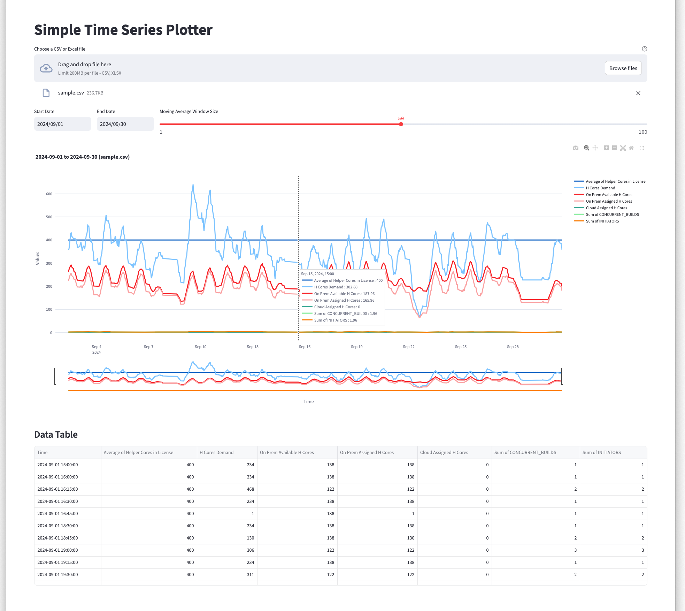

# Simple Time Series Plotter
## Sample
Output



Input
```
Time,Average of Helper Cores in License,H Cores Demand,On Prem Available H Cores,On Prem Assigned H Cores,Cloud Assigned H Cores,Sum of CONCURRENT_BUILDS,Sum of INITIATORS
2024-07-10 00:00:00,400,12,144,12,0,1,1
2024-07-10 00:15:00,400,12,144,12,0,1,1
2024-07-10 00:30:00,400,184,152,152,0,1,1
2024-07-10 00:45:00,400,242,257,242,0,3,3
2024-07-10 01:00:00,400,626,303,303,0,5,5
[....]
```

## How to install & run
```
$ python3 -m venv venv
$ . venv/bin/activate
(venv) $ python -m pip install --upgrade pip
(venv) $ pip install streamlit plotly
(venv) $ streamlit run simple_ts_plotter.py
```

## Limits
- Support formats: xlsx or csv
- 1st row: header of your data
  - 1st column must be "Time" (as x-axis)
  - The rest of the columns are arbitrary and displayed as y-axes
- 2nd row and onward (data)
  - 1st column: date/time
  - The rest of the columns: numeric
